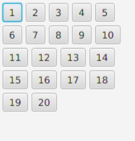
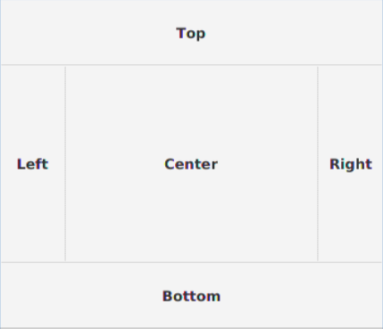
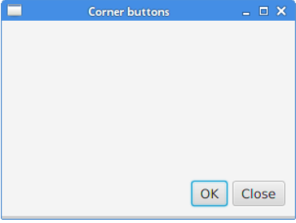

# Different panes
### Flow Pane
`FlowPane` positions node in a row or column based on the orientation value, where nodes are wrapped when they all cannot be shown. The default orientation of a flow pane is `Orientation.HORIZONTAL`
```java
// Initialize a flow pane that lays components
// vertically and has a certain value of horizontal gap and vertical gap.
import javafx.scene.layout.FlowPane;
FlowPane flowPain = new FlowPane(Orientation.HORIZONTAL, hgap, vgap)
```


Suppose you have 20 buttons, flow pane would lay them out based on the given orientation(in this case horizontal) while keeping the gaps(distance between nodes) horizontally, and vertically. Once there is no space to show everything, it would automatically wrap it and change to a new line.

### HBox
An `HBox` is just a horizontal box of nodes, this is a very simple and basic layout that is often used to cooperate with other complex layouts.
For example, if we want a simple row of buttons, we can use `HBox`


### BorderPane
`BorderPane` lays out children in top, left, right, bottom, and center positions.


### Anchor Pane
AnchorPane anchors the edges of child nodes to an offset from the anchor pane's edges. If the anchor pane has a border or padding set, the offsets will be measured from the inside edge of those insets.
For example, this piece of code:
```java
AnchorPane.setRightAnchor(hbox, 10d);
AnchorPane.setBottomAnchor(hbox, 10d);
```
sets the node hbox to be in the bottom right corner of the pane with an offset of 10, which results in:


### Grid Pane
A `GridPane` places its nodes into a grid of rows and columns. Nodes may span multiple rows or columns. GridPane is the most flexible built-in layout pane. 


# FX CSS
 my little cheat-sheet for common style attributes

### To change the font color:
```css
.text {
    -fx-text-fill: #hex or rgba
}
```


